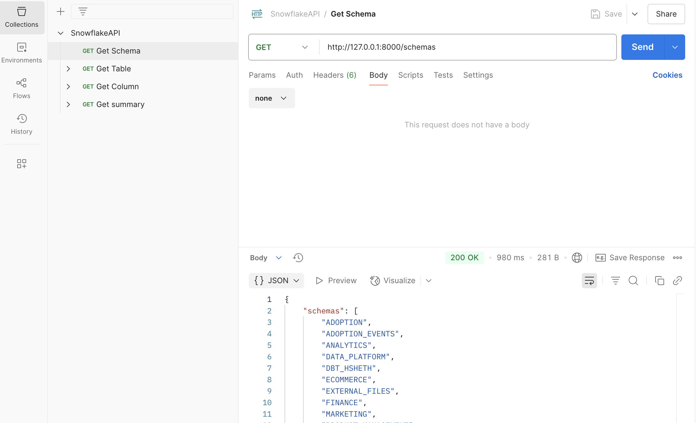
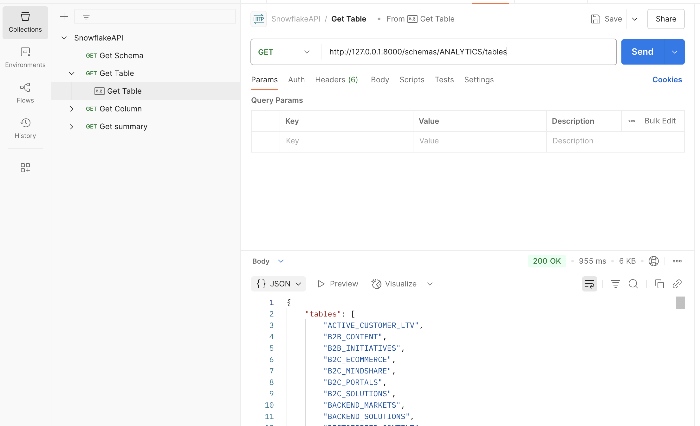

Snowflake Metadata API

This is a FastAPI application for Snowflake database. It allows users to list schemas, tables, columns, and generate basic summary statistics on tables.

Features:
- List all schemas in a Snowflake database
- List tables within a schema
- List columns in a table
- Generate summary statistics including count, average, min, max, distinct count

Setup Instructions:

1. Clone the repository:

   git clone https://github.com/sikun-peng/snowflake-api.git
   cd snowflake-api

2. Install Python dependencies:

   pip3 install -r requirements.txt

3. Set environment variables:

   Create a .env file in the root directory with the following content:

   SNOWFLAKE_ACCOUNT=your_account
   SNOWFLAKE_USER=your_user
   SNOWFLAKE_PASSWORD=your_password
   SNOWFLAKE_ROLE=your_role
   SNOWFLAKE_WAREHOUSE=your_warehouse
   SNOWFLAKE_DATABASE=your_database

4. Run the API server:

   uvicorn main:app --reload

5. Access the API documentation:

   Open http://localhost:8000/docs in your browser.

API Endpoints with Examples:

1. GET /schemas
   Description: List all schemas in the database.
   Screenshot: 

2. GET /schemas/{schema_name}/tables
   Description: List tables within a given schema.
   Screenshot: 

3. GET /schemas/{schema_name}/tables/{table_name}/columns
   Description: List columns of a specific table.
   Screenshot: 

4. GET /schemas/{schema_name}/tables/{table_name}/summary
   Description: Return summary statistics of numeric and categorical columns.
   Screenshot: 